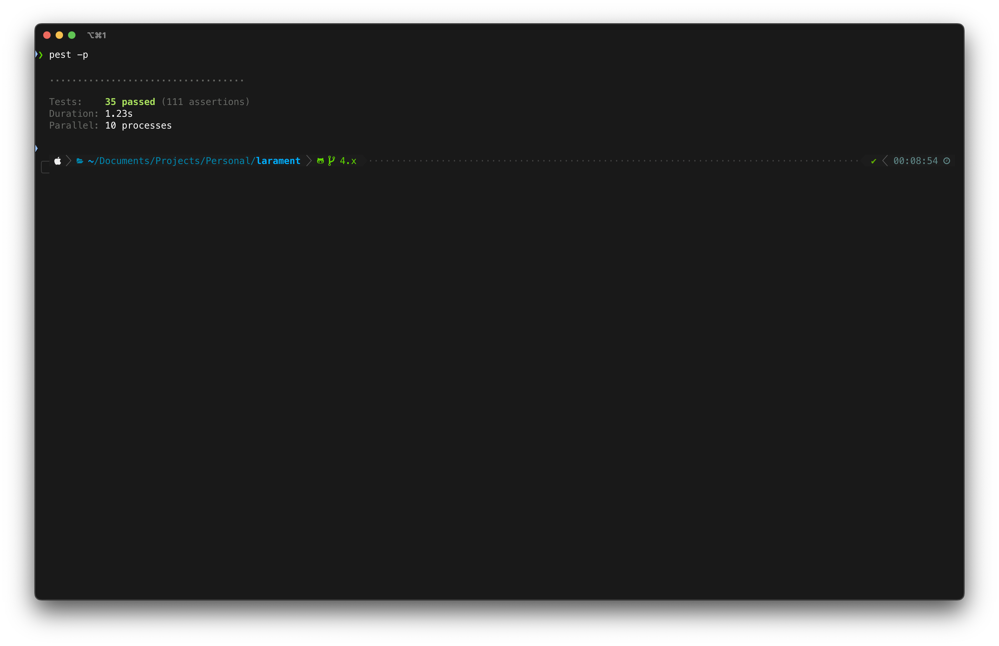

# Larament (Laravel 12 + Filament 4)


[](https://packagist.org/packages/codewithdennis/larament)
[](https://packagist.org/packages/codewithdennis/larament)
[](https://github.com/CodeWithDennis/larament/actions/workflows/phpstan.yml)
[](https://packagist.org/packages/codewithdennis/larament)
[](https://packagist.org/packages/codewithdennis/larament)


> [!CAUTION]
> **Filament 4** is currently in beta, please use it with caution in production environments.

**Larament** is a time-saving starter kit to quickly launch Laravel `12.x` projects. It includes **FilamentPHP** `4.x` pre-installed and configured, along with additional tools and features to streamline your development workflow.


## Dependencies

This project includes several core dependencies that provide essential functionality:

- **[nunomaduro/essentials](https://github.com/nunomaduro/essentials)**: Essentials provide better defaults for your Laravel applications including strict models, automatically eagerly loaded relationships, immutable dates, and more!

### Development

This project includes several development dependencies to ensure code quality and streamline the development process:

- **[larastan/larastan](https://github.com/larastan/larastan)**: Static analysis tool for Laravel applications
- **[laravel/pint](https://laravel.com/docs/12.x/pint)**: PHP code style fixer for Laravel projects
- **[pestphp/pest](pestphp.com/docs/installation)**: Elegant PHP testing framework
- **[pestphp/pest-plugin-faker](https://pestphp.com/docs/plugins)**: Faker integration for Pest
- **[pestphp/pest-plugin-laravel](https://pestphp.com/docs/plugins)**: Laravel integration for Pest
- **[pestphp/pest-plugin-livewire](https://pestphp.com/docs/plugins)**: Livewire testing utilities for Pest
- **[rector/rector](https://github.com/rectorphp/rector)**: Automated code refactoring tool

These tools help maintain code quality, provide testing capabilities, and improve the development experience. Larament comes with a bunch of tests to ensure everything works as expected.



## Default Configurations

Larament comes with several pre-configured settings to enhance your development experience:

### Filament Admin Panel
- **SPA Mode**: Enabled by default for a smoother, more responsive admin experience
- **Color Scheme**: Uses Filament's Blue color as the primary theme
- **Authentication**: Custom login page with auto-filled credentials in local environment for easier development

### Table Configuration
All Filament tables are pre-configured with:
- **Striped Rows**: For better visual separation between rows
- **Deferred Loading**: Improves performance by loading table data after the initial page load

## Development Commands

Larament includes a convenient composer command to streamline your development workflow:

```bash
composer review
```

This command runs all code quality tools in sequence:
- Laravel Pint for code style fixing
- Rector for automated code refactoring
- PHPStan for static analysis
- Pest for testing

## Installation

Create a new Larament project and set it up with a single command:

```bash
composer create-project codewithdennis/larament your-project-name
cd your-project-name 
composer install
npm install
php artisan serve
```

### Create a terminal alias
For easier usage in future projects, create an alias in your terminal:

```bash
alias larament="composer create-project --prefer-dist CodeWithDennis/larament"
```

Now, you can create a new project with a simple command:

```bash
larament basecamp
```
