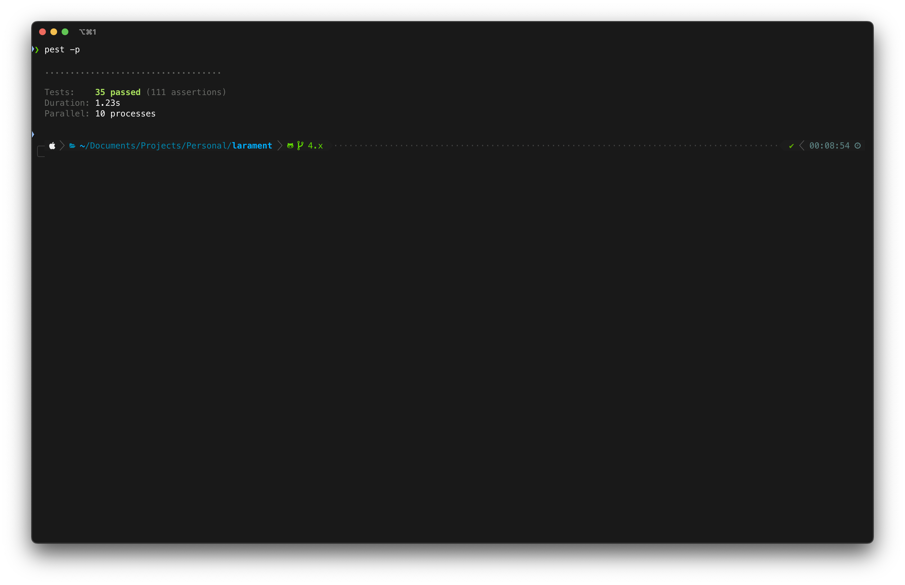
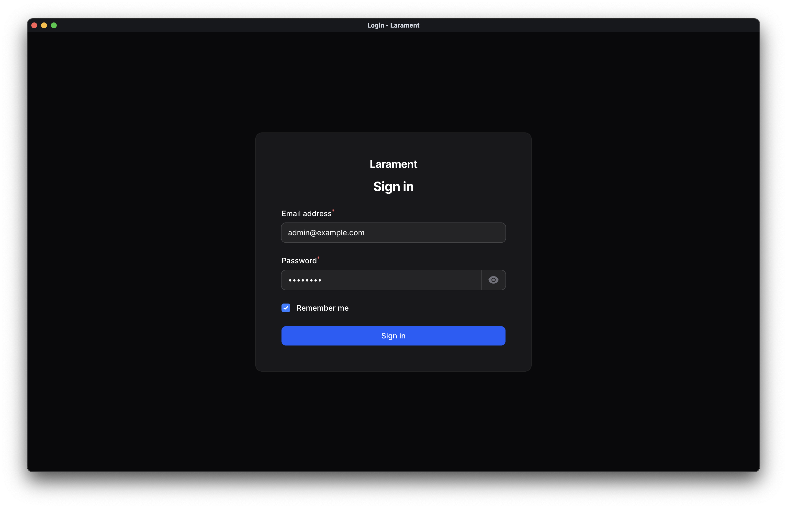
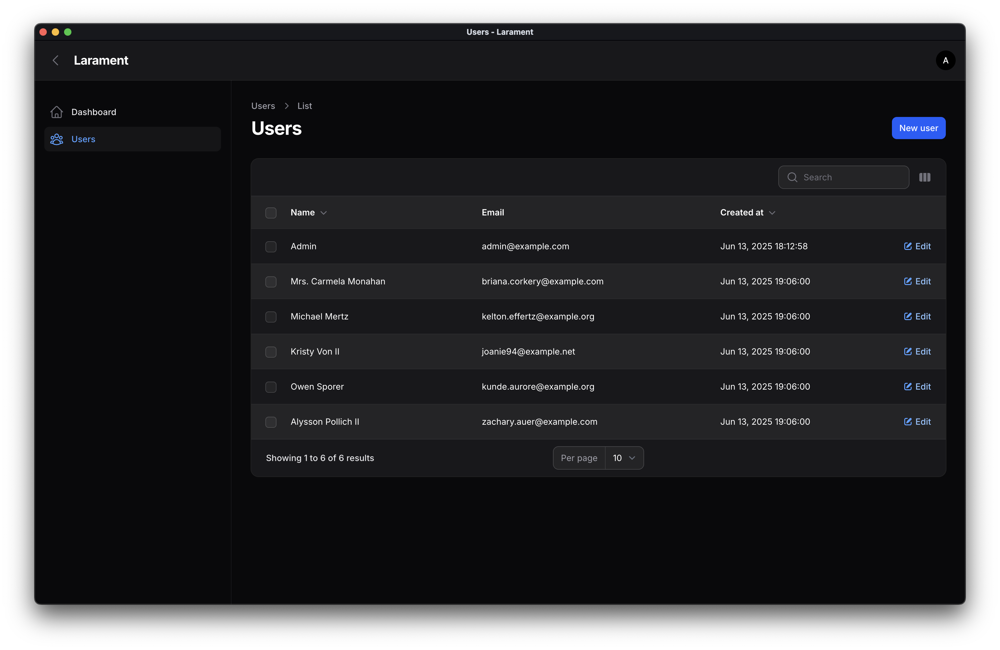

# Larament

[](https://packagist.org/packages/codewithdennis/larament)
[](https://packagist.org/packages/codewithdennis/larament)
[](https://github.com/CodeWithDennis/larament/actions/workflows/phpstan.yml)
[](https://packagist.org/packages/codewithdennis/larament)
[](https://packagist.org/packages/codewithdennis/larament)

Larament is a **bloat-free starter kit** for quickly launching **Laravel 12.x** projects. It comes with **FilamentPHP 4.x** pre-installed and configured, plus essential tools to speed up your development—nothing more, nothing unnecessary.

> [!CAUTION]
> **Filament 4** is currently in beta — use it cautiously in production.

> [!NOTE]
> Larament requires **PHP 8.3** or higher to run.

## Dependencies

This project includes several core dependencies that provide essential functionality:

- **[nunomaduro/essentials](https://github.com/nunomaduro/essentials)**: Essentials provide better defaults for your Laravel applications including strict models, automatically eagerly loaded relationships, immutable dates, and more!

## Development

This project includes several development dependencies to ensure code quality and streamline the development process:

- **[larastan/larastan](https://github.com/larastan/larastan)**: Static analysis tool for Laravel applications
- **[laravel/pint](https://laravel.com/docs/12.x/pint)**: PHP code style fixer for Laravel projects
- **[pestphp/pest](pestphp.com/docs/installation)**: Elegant PHP testing framework
- **[pestphp/pest-plugin-faker](https://pestphp.com/docs/plugins)**: Faker integration for Pest
- **[pestphp/pest-plugin-laravel](https://pestphp.com/docs/plugins)**: Laravel integration for Pest
- **[pestphp/pest-plugin-livewire](https://pestphp.com/docs/plugins)**: Livewire testing utilities for Pest
- **[rector/rector](https://github.com/rectorphp/rector)**: Automated code refactoring tool
- **[barryvdh/laravel-debugbar](https://github.com/barryvdh/laravel-debugbar)**: A package that providing insights into queries, requests, and performance metrics during development.

These tools help maintain code quality, provide testing capabilities, and improve the development experience. Larament comes with a bunch of tests to ensure everything works as expected.



## Configurations

Larament comes with several pre-configured settings to enhance your development experience:

### Filament Admin Panel
- SPA Mode enabled by default for a smoother, more responsive admin experience
- `Color::Blue` color as the primary color
- Custom login page with autofilled credentials in local environment for easier development
- Includes a pre-configured custom theme, allowing for easy styling customization and consistent design across your admin panel
- Profile enabled by default, allowing users to manage their profiles directly from the admin panel
- (MFA) is enabled by default (App Authentication), providing an extra layer of security for your admin panel


 
### Filament Table Configuration
All Filament tables are pre-configured with:
- **Striped Rows**: For better visual separation between rows
- **Deferred Loading**: Improves performance by loading table data after the initial page load



### Laravel Migration Stubs
Larament includes custom migration stubs that removes the `down()` method by default. The removal of the `down()` method is a debated topic in the Laravel community - while some developers prefer to keep it for rollback capabilities, others find it rarely used in practice. If you prefer to keep the `down()` method, you can simply remove these custom stubs and Laravel will use its default migration templates.

```php
<?php

declare(strict_types=1);

use Illuminate\Database\Migrations\Migration;
use Illuminate\Database\Schema\Blueprint;
use Illuminate\Support\Facades\Schema;

return new class() extends Migration
{
    public function up(): void
    {
        //
    }
};
```

### Helper Functions
Larament comes with a pre-configured `app/Helpers.php` file where you can define your own helper functions. The file is already set up in your `composer.json` for autoloading. Here's an example of how to add your own helper functions:

```php
if (! function_exists('example')) {
    function example(): string
    {
        return 'This is an example function you can use in your project.';
    }
}
```

## Development Commands

Larament includes a convenient composer command to streamline your development workflow:

```bash
composer review
```

This command runs all code quality tools in sequence:
- Laravel Pint for code style fixing
- Rector for automated code refactoring
- PHPStan for static analysis
- Pest for testing

## Installation

Create a new Larament project and set it up with a single command:

```bash
composer create-project codewithdennis/larament your-project-name
cd your-project-name 
composer install
npm install
npm run build
php artisan serve
```

### Create a terminal alias
For easier usage in future projects, create an alias in your terminal:

```bash
alias larament="composer create-project --prefer-dist CodeWithDennis/larament"
```

Now, you can create a new project with a simple command:

```bash
larament basecamp
```
