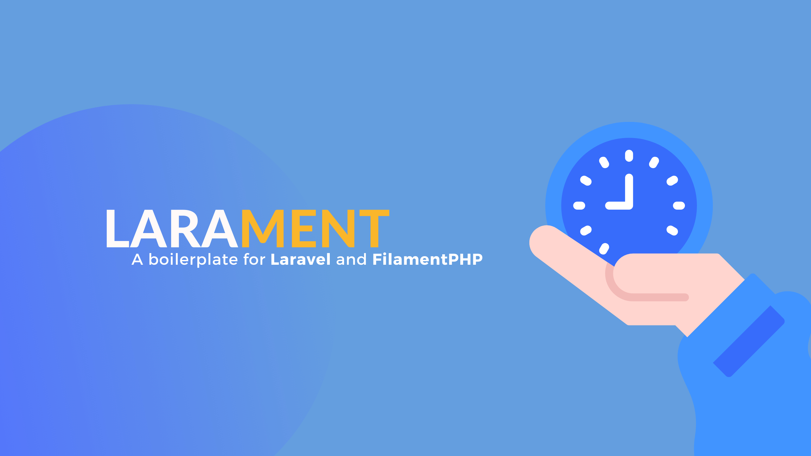

# Larament
Kickstart your project and save time with Larament! This time-saving starter kit includes a Laravel project with FilamentPHP already installed and set up, along with extra features.

> [!NOTE]
> This starter kit includes **Laravel 11** and **FilamentPHP 3** with some packages that improve the development experience. This will not contain any bloated features or unnecessary packages. If you want to add more features, you can do so by installing the necessary packages. 



## Installation

**[Use this template](https://github.com/new?template_name=larament&template_owner=CodeWithDennis)** to create a new repository and clone it to your local machine, then navigate to the project directory to run the necessary commands.

```bash
composer install
npm install && npm run build
cp .env.example .env
php artisan key:generate
```

By [default](https://laravel.com/docs/11.x/releases#application-defaults) the project uses **SQLite** as the database. If you want to use another database, update the `.env` file with your database preferences before running the migration.

```bash
php artisan migrate --seed
```

## Filament

### Panel Color
The primary color for the Filament Panel is set to `Color::Blue`.

### SPA
[SPA](https://filamentphp.com/docs/3.x/panels/configuration#spa-mode) (Single Page Application) is enabled by default.

### Login
A custom login page that **automatically** fills in the email and password fields with seeded data, making it easy to test locally without entering credentials. You can find the custom login page in the `App\Filament\Pages\Auth` directory.


### Generate Password
A custom action for generating passwords on the user's profile page and user resource. You can find the action in the `App\Filament\Actions` directory.

### Profile
A custom profile page that uses the generated password action. You can find the profile page in the `App\Filament\Pages\App` directory.


### Theme
A [custom theme](https://filamentphp.com/docs/3.x/panels/themes#creating-a-custom-theme) that is ready to be used. You can find the empty theme stylesheet in the `resources/css/filament/admin` directory.

## Packages

### [timokoerber/laravel-one-time-operations](https://github.com/TimoKoerber/laravel-one-time-operations)
This package allows you to run one-time operations in your Laravel application. Instead of adding a new migration for a simple task, you can use this package to run the operation only once.

### [barryvdh/laravel-debugbar](https://github.com/barryvdh/laravel-debugbar)
This package provides a developer toolbar for debugging Laravel applications. It includes a lot of helpful information like queries, routes, views, and more.

> This package is only installed in the development environment.

> [!NOTE]
> Keep in mind that the debugbar views collector might slow down your application due to view rendering, but you can turn it off in the debugbar config file if you don't need it.

### [pestphp/pest](https://pestphp.com/docs/installation)
Pest is a testing framework with a focus on simplicity, meticulously designed to bring back the joy of testing in PHP.

> This package is only installed in the development environment.

#### Additional Plugins
- [pestphp/pest-plugin-faker](https://pestphp.com/docs/plugins#faker) 
- [pestphp/pest-plugin-laravel](https://pestphp.com/docs/plugins#laravel)
- [pestphp/pest-plugin-livewire](https://pestphp.com/docs/plugins#livewire)

## Boilerplate
The following files are part of the project and can be removed.
- larament.png
